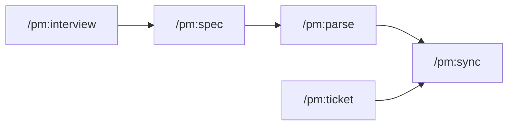

# pure-magic

pure-magic is a PM workflow plugin for Claude Code. It helps you write better specs, structure tasks, capture customer insights, and push everything to your issue tracker - without leaving your terminal or switching between five different tools.

## The problem it solves

PM work is scattered. You write a spec in Notion, copy tasks into Jira by hand, keep interview notes in a Google Doc, and hope everyone reads the right version. By the time a feature ships, the original thinking is buried across three tools and nobody remembers why a decision was made.

Working with AI does not fix this - it often makes it worse. With ChatGPT, Claude in the browser, or most AI tools, you paste documents in at the start of every conversation, re-explain your product from scratch, and lose everything when the session ends. The AI has no memory of what you built last week.

pure-magic is different because it runs inside Claude Code, which means it reads your files directly. Your specs, interview notes, project config, and past decisions are already there - you do not paste anything. Claude picks up where you left off because the context lives in your folder, not in a chat window.

That also means you own the files. They live on your computer, in plain markdown. No tool is the gatekeeper. If you switch to a different AI tomorrow, the files go with you - any model that can read a folder can pick up the work. Your PM thinking is not locked into any platform.

## How it fits into your workflow



For a large feature, run the full flow from interview to sync. For a small fix, jump straight to `/pm:ticket`. The skills are independent - use what fits the situation.

## What lives where

PM outputs are written to a named project subfolder in your workspace root.

```
<your-project>/
  specs/          feature specs
  tasks/          task files, grouped by feature
  tickets/        standalone bugs and requests
  interviews/     customer interview guides
  pm-config.md    project settings (provider, repo, labels)
```

Plugin infrastructure (rules, templates, overrides) lives in `.claude/` and is managed by the plugin automatically.

## Skills

| Skill | Page |
|---|---|
| /pm:spec | [Writing a spec](pm-spec) |
| /pm:parse | [Breaking a spec into tasks](pm-parse) |
| /pm:ticket | [Creating a standalone ticket](pm-ticket) |
| /pm:interview | [Customer interview guides](pm-interview) |
| /pm:sync | [Pushing to GitHub or Jira](pm-sync) |
| /pm:validate | [Validating file quality](pm-validate) |
